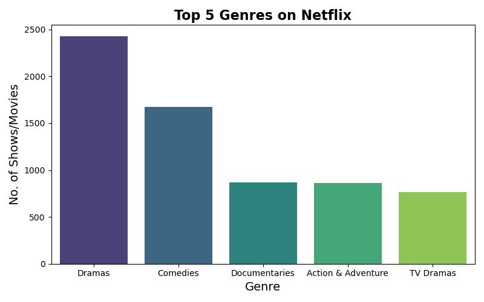
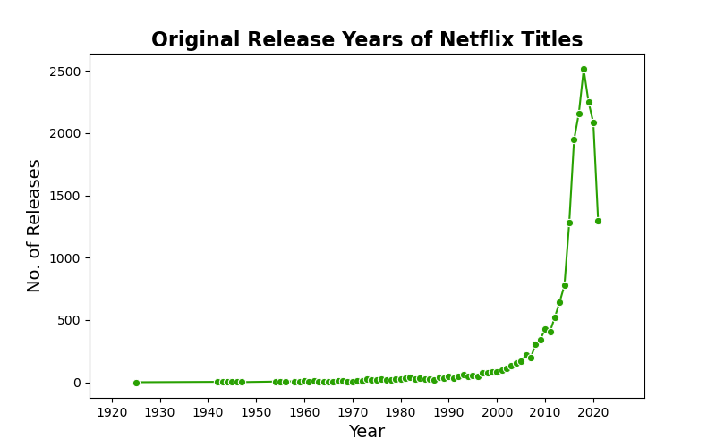
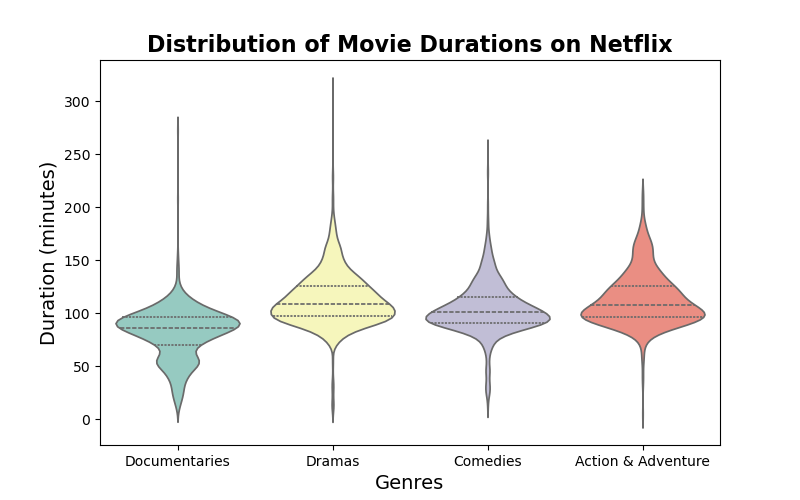

# Exploring trends in Netflix movies and TV shows using Python

---
# Overview:
In the project, I have used Netflix movies and TV shows dataset do analysis on the data. I wanted to explore the data then handling of missing data, and also visualize it into graphs to see trends and simplify the data. This dataset is chosen because in the current times the usage of digital media has gone up exponentially and keeps on growing as time goes on.

---
# Dataset:
Dataset Kaggle Link:
https://www.kaggle.com/datasets/shivamb/netflix-shows

The dataset contains 8807 rows and 12 columns, and it contains information about the different movies/TV shows such as their genre, duration, director and a brief description about it.

---
# Process:
- Loading and Exploring Datasets
- Data cleaning(Removing duplicates, NaNs, changing datatypes)
- Visualization of Data(Bar plot on popularity of genre, line plot on release years, violin plot on average movie runtime)

---
# Key Findings:
- Top genres: Dramas, Comedies, Documentaries, Action & Adventure, TV Dramas.
- Most popular release years: 2017, 2018 and 2019
- Distribution of movie runtime:  Between 90-100 minutes depending on genres.

---
# Visualizations:

---
# Tools used:
- Python
- Numpy
- Matplotlib
- Seaborn
- Jupyter

# Problems/Struggles
While cleaning the data, had to look up multiple documentations and see examples of how other people dealt with all the different possible errors in data that should be fixed. But, it also helped out a lot in the process of handling the missing data, duplicates and fixing the datatypes for the proper visualization.